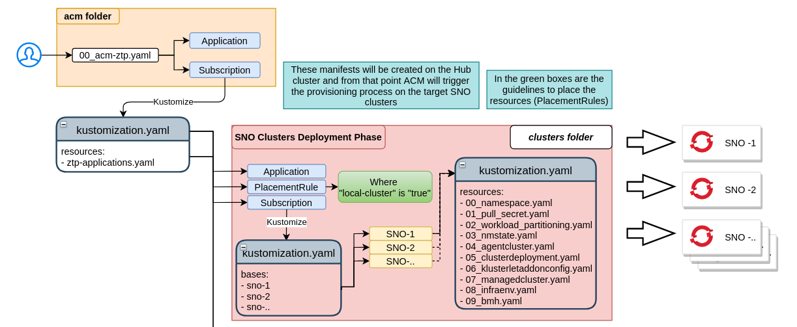
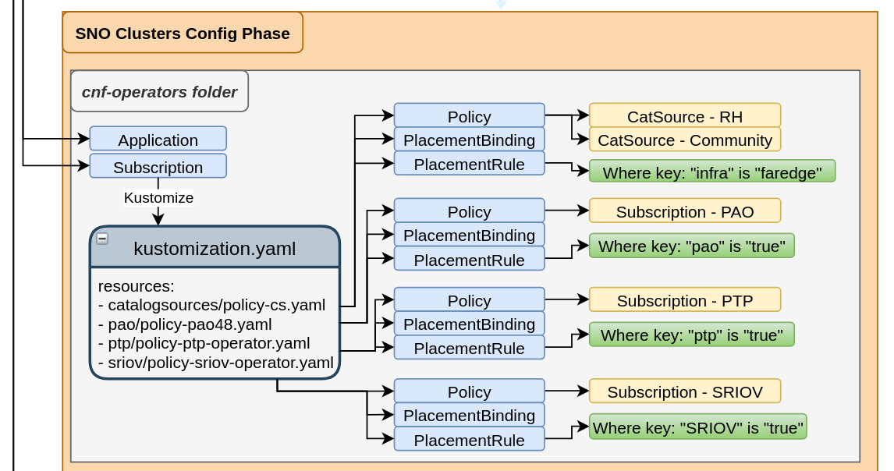
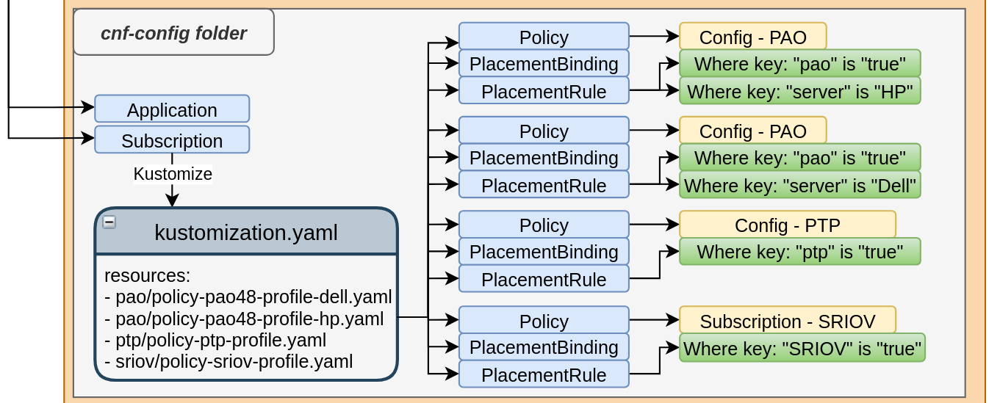

# Automation only using RHACM
<!-- TOC GFM -->

- [Pre-requisites for the automation](#pre-requisites-for-the-automation)
- [Automation](#automation)
    - [Cluster Deployments](#cluster-deployments)
    - [CNF Operator Deployments](#cnf-operator-deployments)
    - [CNF Configurations](#cnf-configurations)
- [Samples](#samples)

<!-- /TOC -->

Long story short, this involves more control about the apps + subs you are deploying but it will overload a bit ETCD and the RHACM API when there are many SNOs.

We will start with some assumtions, we have already some things deployed and working fine:

- OCP 4.8.X
- RHACM 2.3.X
- Assisted service pod running fine (for Connected or Disconnected envs, that depend on you)

## Pre-requisites for the automation

Now we will need to work with a Git repository (in both scenarios con and discon) because we will work with GitOps way of work, for that we will create som objects:

- A Namespace to hold all these configurations
- A ClusterRoleBinding to allow the SA to interact using the UI and the CLI
- A Channel to tell RHACM that should follow th changes on a concrete Repository and Branch
- A PlacementRule to deploy all these things in the Hub cluster and in the created Namespace
- (Optional) A subscription to deploy other prerequisites like cloud be ClusterImageSets, PullSecret, DisconnectedMirror Config or the AssistedServiceConfig

> :warning: This last one it's purely optional, just to be a more automated task.

These are some samples of the objects mentioned:

```yaml
---
apiVersion: v1
kind: Namespace
metadata:
  name: ztp-clusters
---
apiVersion: rbac.authorization.k8s.io/v1
kind: ClusterRoleBinding
metadata:
  name: open-cluster-management:subscription-admin
roleRef:
  apiGroup: rbac.authorization.k8s.io
  kind: ClusterRole
  name: open-cluster-management:subscription-admin
subjects:
- apiGroup: rbac.authorization.k8s.io
  kind: User
  name: kube:admin
- apiGroup: rbac.authorization.k8s.io
  kind: User
  name: system:admin
---
apiVersion: apps.open-cluster-management.io/v1
kind: Channel
metadata:
  name: ztp-repository
  namespace: ztp-clusters
spec:
  type: Git
  ## This is the URL of the Git Repository in a IPv6/Disconnected environment
  pathname: http://dummy:dummy@[fd00:4888:2000:1099::11]:3000/faredge-ztp/faredge-ztp.git
---
apiVersion: apps.open-cluster-management.io/v1
kind: PlacementRule
metadata:
  name: local-cluster-placement
  namespace: ztp-clusters
  annotations: {}
  labels:
    app: cluster-deployments
spec:
  clusterSelector:
    matchLabels:
      local-cluster: 'true'
---
apiVersion: apps.open-cluster-management.io/v1
kind: Subscription
metadata:
  name: acm-prereqs-subscription
  namespace: ztp-clusters 
  annotations:
    apps.open-cluster-management.io/git-branch: main
    apps.open-cluster-management.io/git-path: acm-prereqs/
    apps.open-cluster-management.io/reconcile-option: merge
  labels:
    app: acm-prereqs
    app.kubernetes.io/part-of: acm-prereqs
spec:
  channel: ztp-clusters/ztp-repository
  placement:
    placementRef:
      name: local-cluster-placement
      kind: PlacementRule
```

With all of these objects we are telling to RHACM that we want to monitor all the `Kustomized` objects from `http://dummy:dummy@[fd00:4888:2000:1099::11]:3000/faredge-ztp/faredge-ztp.git` repo following the **main** branch and the path **acm-prereqs**, so you will have this:

```
faredge-ztp
└── acm-prereqs
    ├── 00_pre-reqs.yaml
    ├── 01_clusterimageset.yaml
    ├── 02_pull_secret.yaml
    ├── 03_disconnected_mirror_config.yaml
    ├── 04_assisted-service.yaml
    └── kustomization.yaml
```

where:

- `00_pre-reqs.yaml` contains the objects mentioned before
- 01-04 files contains some other objects required for the well working of RHACM and SNO deployment
- `kustomization.yaml` references the 01-04 files to be loaded with the last object (`Subscription`) in the objects above.

And this is basically the process:


From this point, all the automation will be in a "chain" and the steps are linked between themselves. Ensure that all the resources are well created before continue.

## Automation

Now we are ready to create our automation chain, for that we will contain all the objects in multiple folders:

- clusters: It will contain the cluster definitions
- cnf-operators: It will contain the Common objects like ICSP, CatalogSources, Storage and also the CNF Operators, like SRIOV, FEC, etc...
- cnf-configs: It will contain the CNF Configurations and the workload profiles to be applied on the concrete clusters.

> :warning: NOTE: This is as flexible as you want, just separate the onjects in the groups you want and create an Application and Subscription for each folder you have in order to deploy all of the automation objects.

This is how looks like in our sample:

```
├── acm
│   ├── 00_acm-demo.yaml
│   ├── kustomization.yaml
│   └── ztp-applications.yaml
├── acm-prereqs
│   ├── 00_pre-reqs.yaml
│   ├── 01_clusterimageset.yaml
│   ├── 02_pull_secret.yaml
│   ├── 03_disconnected_mirror_config.yaml
│   ├── 04_assisted-service.yaml
│   └── kustomization.yaml
├── clusters
│   ├── kustomization.yaml
│   ├── sno-1/
│   └── sno-2/
├── cnf-configs
│   ├── kustomization.yaml
│   ├── pao/
│   └── ptp/
└── cnf-operators
    ├── catalogsources/
    ├── kustomization.yaml
    ├── pao/
    ├── ptp/
    └── sriov/
```

Here the stating point is the **acm** folder, we need to create the `00_acm-demo.yaml` file and it will trigger all the automation:

- It creates an app and a subscription which calls `ztp-applications.yaml` (inside of this folder), this could be a sample:
```
apiVersion: app.k8s.io/v1beta1
kind: Application
metadata:
  name: acm-demo
  namespace: ztp-clusters
spec:
  componentKinds:
  - group: apps.open-cluster-management.io
    kind: Subscription
  descriptor: {}
  selector:
    matchExpressions:
      - key: app
        operator: In
        values: 
          - acm-demo
---
apiVersion: apps.open-cluster-management.io/v1
kind: Subscription
metadata:
  annotations:
    apps.open-cluster-management.io/git-branch: main
    apps.open-cluster-management.io/git-path: acm
    apps.open-cluster-management.io/reconcile-option: merge
  labels:
    app: acm-demo
  name: acm-demo-subscription-1
  namespace: ztp-clusters
spec:
  channel: ztp-clusters/ztp-repository
  placement:
    placementRef:
      kind: PlacementRule
      name: local-cluster-placement
```


This `ztp-applications.yaml` will create 1 App + 1 Subscription for each folder you wanna deploy, this also includes policies and clusters. In the case of the first app (the above one) we are creating the app that will create the rest of the apps. This is how looks like this file:

### Cluster Deployments

```
---
apiVersion: app.k8s.io/v1beta1
kind: Application
metadata:
  name: cluster-deployments
  namespace: ztp-clusters
  annotations:
    apps.open-cluster-management.io/deployables: ''
spec:
  componentKinds:
    - group: apps.open-cluster-management.io
      kind: Subscription
  descriptor: {}
  selector:
    matchExpressions:
      - key: app
        operator: In
        values:
          - cluster-deployments
---
apiVersion: apps.open-cluster-management.io/v1
kind: Subscription
metadata:
  name: cluster-deployments-subscription
  namespace: ztp-clusters
  annotations:
    apps.open-cluster-management.io/git-branch: main
    apps.open-cluster-management.io/git-path: clusters/
    apps.open-cluster-management.io/reconcile-option: merge
  labels:
    app: cluster-deployments
    app.kubernetes.io/part-of: cluster-deployments
spec:
  channel: ztp-clusters/ztp-repository
  placement:
    placementRef:
      name: local-cluster-placement
      kind: PlacementRule
---
apiVersion: apps.open-cluster-management.io/v1
kind: PlacementRule
metadata:
  name: local-cluster-placement
  namespace: ztp-clusters
  annotations: {}
  labels:
    app: cluster-deployments
    app.kubernetes.io/part-of: cluster-deployments
spec:
  clusterSelector:
    matchLabels:
      local-cluster: 'true'
```



Regarding this part, it's mostly what we've been describing in `*-ZTP-flow-hub-deployment.md` the same files are included in the `clusters/sno-X` folders


### CNF Operator Deployments

```
--- 
apiVersion: app.k8s.io/v1beta1
kind: Application
metadata:
  name: cnf-operators
  namespace: ztp-clusters
  annotations:
    apps.open-cluster-management.io/deployables: ''
spec:
  componentKinds:
    - group: apps.open-cluster-management.io
      kind: Subscription
  descriptor: {}
  selector:
    matchExpressions:
      - key: app
        operator: In
        values:
          - cnf-operators
---
apiVersion: apps.open-cluster-management.io/v1
kind: Subscription
metadata:
  name: cnf-operators-subscription-1
  namespace: ztp-clusters
  annotations:
    apps.open-cluster-management.io/git-branch: main
    apps.open-cluster-management.io/git-path: cnf-operators/
    apps.open-cluster-management.io/reconcile-option: merge
  labels:
    app: cnf-operators
    app.kubernetes.io/part-of: cnf-operators
spec:
  channel: ztp-clusters/ztp-repository
  placement:
    placementRef:
      name: local-cluster-placement
      kind: PlacementRule
```



Regarding this Operator deployments, they will contain some policies that will end in the nodes with the right labels associated (set in the PlacementRule which matches the ManagedNode Labels).

This is how looks like one of the policies:

```
---
apiVersion: policy.open-cluster-management.io/v1
kind: Policy
metadata:
  name: policy-pao-operator
  annotations:
    policy.open-cluster-management.io/standards: NIST SP 800-53
    policy.open-cluster-management.io/categories: CM Configuration Management
    policy.open-cluster-management.io/controls: CM-2 Baseline Configuration
spec:
  remediationAction: enforce
  disabled: false
  policy-templates:
    - objectDefinition:
        apiVersion: policy.open-cluster-management.io/v1
        kind: ConfigurationPolicy
        metadata:
          name: policy-pao-subscription
        spec:
          remediationAction: enforce # the policy-template spec.remediationAction is overridden by the preceding parameter value for spec.remediationAction.
          severity: low
          namespaceSelector:
            exclude: ["kube-*"]
            include: ["*"]
          object-templates:
            ## Namespace
            - complianceType: musthave
              objectDefinition:
                apiVersion: v1
                kind: Namespace
                metadata:
                  name: openshift-performance-addon-operator
                  annotations:
                    workload.openshift.io/allowed: management
                  labels:
                    openshift.io/cluster-monitoring: "true"
                spec: {}
            ## OperatorGroup
            - complianceType: musthave
              objectDefinition:
                apiVersion: operators.coreos.com/v1
                kind: OperatorGroup
                metadata:
                  name: performance-addon-operator
                  namespace: openshift-performance-addon-operator
            ## Subscription
            - complianceType: musthave
              objectDefinition:
                apiVersion: operators.coreos.com/v1alpha1
                kind: Subscription
                metadata:
                  name: performance-addon-operator-subscription
                  namespace: openshift-performance-addon-operator
                spec:
                  channel: "4.8"
                  name: performance-addon-operator
                  source: redhat-operator-index
                  sourceNamespace: openshift-marketplace
```

all of them should also contain the `PlacementBinding` and `PlacementRule`:

```
---
apiVersion: policy.open-cluster-management.io/v1
kind: PlacementBinding
metadata:
  name: binding-policy-pao
placementRef:
  name: placement-policy-pao
  kind: PlacementRule
  apiGroup: apps.open-cluster-management.io
subjects:
- name: policy-pao-operator
  kind: Policy
  apiGroup: policy.open-cluster-management.io
---
apiVersion: apps.open-cluster-management.io/v1
kind: PlacementRule
metadata:
  name: placement-policy-pao
spec:
  clusterConditions:
  - status: "True"
    type: ManagedClusterJoined 
  clusterSelector:
    matchExpressions:
      - {key: pao, operator: In, values: ["true"]}
```

### CNF Configurations

```
---
apiVersion: app.k8s.io/v1beta1
kind: Application
metadata:
  name: cnf-operators-configs
  namespace: ztp-clusters
  annotations:
    apps.open-cluster-management.io/deployables: ''
spec:
  componentKinds:
    - group: apps.open-cluster-management.io
      kind: Subscription
  descriptor: {}
  selector:
    matchExpressions:
      - key: app
        operator: In
        values:
          - cnf-operators-configs
---
apiVersion: apps.open-cluster-management.io/v1
kind: Subscription
metadata:
  name: cnf-operators-configs-subscription-1
  namespace: ztp-clusters
  annotations:
    apps.open-cluster-management.io/git-branch: main
    apps.open-cluster-management.io/git-path: cnf-config/
    apps.open-cluster-management.io/reconcile-option: merge
  labels:
    app: cnf-operators-configs
    app.kubernetes.io/part-of: cnf-operators-configs
spec:
  channel: ztp-clusters/ztp-repository
  placement:
    placementRef:
      name: local-cluster-placement
      kind: PlacementRule
```



This regards the concrete node configurations like WorkloadProfile or CNF configs like SRIOV among others.

> :warning: **NOTE**: As we mentioned before, all 3 groups here, the clusters, the operators and the cnf-configs, if you look every group, all are the same things. Every one will tell RHACM, "hey look at that folder and deploy what you have in the `kustomization.yaml` file"


## Samples

We will upload some samples on the `sample-manifests` folder which will contain the automation to be loaded on the RHACM Hub cluster, but before use it, ensure you already reviewed all the fields to match your environment, there are many details to change in order to make this work.
